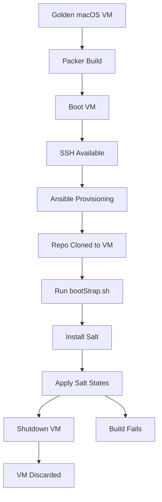

# Continuous Integration (CI)

This repo is designed to be tested before it ever touches a real Mac.

Salt states can be deceptively dangerous on macOS — a bad `defaults write`, a broken `cmd.run`, or a misplaced `sudo` can leave a machine in a right mess. CI exists here to catch that before anything runs on a daily driver or production machine.

Also, CI in a VM using Packer is fun!

The goal is simple. If it passes CI, I’m confident applying it for real. Famous last words, right?

---

## What CI Means

CI means:
- building a throwaway macOS VM
- applying Salt states inside that VM
- verifying they converge cleanly and idempotently
- then throwing the VM away

No state is trusted unless it survives this process.

---

## The Golden Image

CI starts from a golden macOS VM

Shopping list:
- Parallels Pro
- Packer
- Ansible

This VM:
- is manually created and kept intentionally minimal
- has Parallels tools installed
- has SSH enabled
- xcode tools installed
- Home Brew is installed

The idea is to create this golden image and never change it. Instead we use Packer to clone it each time we want to run a build test. That being said when Parallels releases a new version with updated Parallels tools I do reimport the VM, update the tools and then unregister the VM.

---

## Packer

[Packer](https://www.packer.io/) is used to automate VM creation and testing.

The Packer workflow looks like this:

1. Clone the golden macOS VM
2. Boot the cloned VM
3. Connect over SSH
4. Run provisioning steps using Ansible. In this case just to clone this repo to the VM
5. Shut the VM down
6. Register it in Parallels

All Packer configuration lives in the repo so anyone can spin up the same test VM locally.

---

## Why a VM and Not Containers?

macOS configuration:
- relies heavily on user sessions
- uses per-user plists
- expects launch services, Dock, Finder, etc.

Containers simply don’t model this well.

A real macOS VM behaves like:
- a real user account
- a real Dock
- a real login session

Which makes failures meaningful instead of theoretical.

---

## How States Are Tested

In short: the same way I would on a fresh Mac.

The beauty of using Packer and a golden VM is that we already start from a known-good state:
- the repo is cloned (using Ansible via Packer)
- Xcode Command Line Tools are installed
- Homebrew is installed

This avoids wasting time waiting for installers during every CI run.

Once the VM is up, all that’s left to do is run the `bootStrap.sh` script. This script:
- installs Salt
- applies the Salt states locally

Normally `bootStrap.sh` can also install Xcode tools and Homebrew, but those steps are intentionally pre baked into the golden VM to keep CI runs fast and predictable.

If the states converge cleanly and idempotently here, I’m happy to trust them on a real machine.

---

## Workflow

